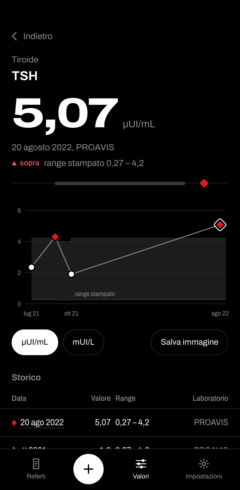
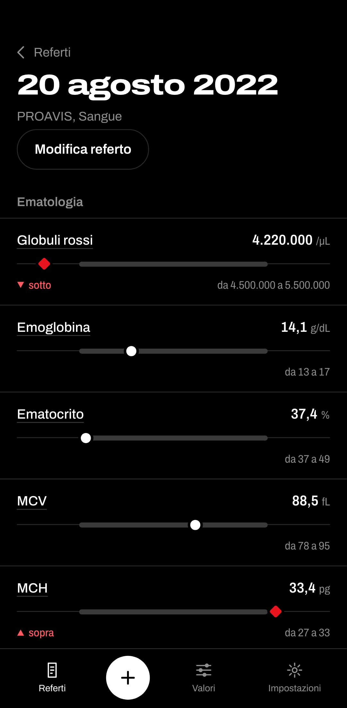

# bloodio

**Live demo:** https://simones99.github.io/bloodio/ (runs entirely in your browser; nothing is uploaded)

A local-first web app for keeping track of your own blood test results. It reads the PDF reports that Italian labs send, turns them into structured measurements, asks you to check every value before anything is stored, and charts each value over time against the reference range printed on the report.

Everything runs in the browser. There is no backend, no account and no telemetry: reports and values stay in the device's IndexedDB and leave it only when the user exports them.

The user interface is in Italian (the target users and the supported lab formats are Italian). Code, comments and this README are in English; the architecture decision records are in Italian.

<p>
  
  
</p>

_Screenshots show the synthetic test fixtures (see [Test data](#test-data)), not real results._

> bloodio is not a medical device. It shows, tracks and compares values with the reference ranges printed on the report. It does not interpret, diagnose or suggest treatment. A disclaimer is shown on first launch and in the settings.

## Privacy by design

The privacy constraints are part of the architecture and are checked by the build, not left to policy.

- **No server-side component.** The production build is a static bundle (`vite build`, relative base path) that can be served from any static host or opened from the file system. There is no API, no login and no cookies.
- **Local persistence only.** Reports, measurements, custom analytes and settings live in IndexedDB through Dexie (`src/storage/db.ts`). The original PDF is stored only if the user turns on "keep original file", which is off by default.
- **No external requests at runtime.** pdf.js and its worker, the Archivo font (`@fontsource-variable/archivo`) and every other dependency are bundled and served from the same origin. pdf.js is loaded lazily, only when a file is chosen.
- **Build gate for external URLs.** `npm run check:bundle` (`scripts/check-bundle.mjs`) scans every text asset in `dist/` and fails if it contains an external URL. The few strings that are allowed (XML namespaces, links inside library error messages) are listed one by one in `scripts/bundle-url-allowlist.json`, each with the reason it is never fetched.
- **Network check in end-to-end tests.** The Playwright tests record every request the page makes and assert that none goes to another origin (`e2e/network.ts`).
- **Real reports never enter the repository.** `examples/` is git-ignored, and the `pre-commit` hook in `.githooks/` rejects any staged PDF or image outside a short allowlist. Test fixtures are positioned-text JSON, not PDFs, and contain only synthetic data (see [Test data](#test-data)). `tests/fixtures/pii-gate.test.ts` checks every committed fixture with `scripts/lib/pii-patterns.mjs` (titled names, birth dates other than the placeholder, tax codes, phone numbers) as part of the test suite.
- **Data portability.** A versioned JSON export and import exists in the storage layer (`src/storage/backup/`). Export is always started by the user. The settings screen for it is still to be built (see [Project status](#project-status)).

A Content Security Policy (`connect-src 'self'`) is planned but **not implemented yet**: the current guarantees come from the bundle scan and the end-to-end network check.

## Data pipeline

```
PDF ──► positioned text ──► lab adapter ──► draft rows ──► human verification ──► IndexedDB ──► charts
        (pdf.js, in browser)  (registry)     (normalised,    (nothing is saved      (Dexie,
                                              flagged)        before confirmation)   versioned)
```

1. **Ingest** (`src/ingest/`). The PDF is read in the browser with pdf.js and turned into _positioned text_: every text item with its page coordinates. The file's SHA-256 hash is computed at the same time.
2. **Parser registry** (`src/parsers/registry.ts`). Each supported lab layout is a separate adapter with a `detect()` score and a `parse()` function. The highest-scoring adapter wins if its score is at least 0.5. Otherwise a generic heuristic adapter is used, and its row confidence is capped at 0.5, so every row it produces goes to manual review. Adding a lab means adding an adapter; existing adapters are not touched.
3. **Matching and normalisation** (`src/domain/`).
   - Printed names are matched against a catalogue of analytes and their printed aliases (`src/domain/catalog/`).
   - Unit spellings are normalised (`mg/dl`, `mg/dL` and `mg/dl.` all become `mg/dL`). Values convert between units with per-analyte factors, for example cholesterol between mg/dL and mmol/L (`src/domain/units.ts`).
   - Reference ranges are parsed from the printed text (`da 13 a 17`, `< 200`, age-stratified ranges) in `src/domain/reference.ts`.
   - Italian number formats are disambiguated, so `1.029` can be a thousand separator or a decimal point. When the printed text alone cannot settle it, the analyte's physically plausible range decides (`src/domain/numbers.ts`).
4. **Data-quality flags** (`src/parsers/draft.ts`). Every draft row carries a confidence score and explicit flags: unknown, suggested or ambiguous analyte, unit that cannot be converted for that analyte, ambiguous number format, age-stratified or derived range. A row is sent to review if any flag is set or its confidence is below the threshold.
5. **Human verification** (`src/ui/pages/VerifyPage.tsx`). The user sees every value read from the report, with doubtful rows listed first, and can correct the value, unit, range or analyte before saving. Nothing is written to storage until the user confirms.
6. **Duplicate detection.** Before verification, the file hash is checked against stored reports. If the same file was already imported, the user is told which report it matches (`ImportPage.tsx`, `reports.findDuplicates`).
7. **Storage and out-of-range flag.** The repository recomputes whether each value is outside its printed range on every write, so the flag is never stale (`src/storage/report-repository.ts`).
8. **Versioned export with migrations** (`src/storage/backup/`).
   - Exports are JSON files with an explicit `version`. On import they are validated with zod schemas, and errors are reported field by field.
   - Older files go through a chain of upgraders (`upgraders[n]` turns version _n_ into _n + 1_). A file from a newer app version is rejected.
   - The current format is version 1, so the chain is empty for now. `tests/fixtures/export-v1.json` is kept unchanged so that every future version must still import it.
   - The Dexie schema is versioned the same way (ADR 0002).
9. **Charts** (`src/ui/chart/`). A hand-written SVG trend chart shows the printed range as a stepped band and can be operated with the keyboard. It can also be exported as a PNG drawn on canvas (ADR 0004).

## Supported lab formats

| Adapter        | Layout                                                      | File                          |
| -------------- | ----------------------------------------------------------- | ----------------------------- |
| `proavis`      | PROAVIS private laboratory reports (text PDF)               | `src/parsers/proavis.ts`      |
| `ast`          | AST (Azienda Sanitaria Territoriale) hospital lab reports   | `src/parsers/ast.ts`          |
| `generic`      | Any other text PDF: row heuristics, every row needs review | `src/parsers/generic.ts`      |

Scanned or photographed reports (OCR) are not supported yet. A PDF without a text layer is reported as such. Values can also be entered by hand.

## Architecture decisions

Recorded as ADRs (in Italian):

- [ADR 0001: Web app stack](docs/adr/0001-stack.md)
- [ADR 0002: Data model and persistence](docs/adr/0002-modello-dati.md)
- [ADR 0003: Import pipeline: positioned text, adapters, draft](docs/adr/0003-pipeline-import.md)
- [ADR 0004: Hand-drawn SVG trend chart](docs/adr/0004-grafico-svg.md)

Design specifications are in [`docs/specs/`](docs/specs/), and bundle size is tracked in [`docs/bundle-size.md`](docs/bundle-size.md).

Stack: React 19, TypeScript (strict), Vite, React Router, Dexie (IndexedDB), pdf.js, zod. Tests use Vitest, Testing Library, fake-indexeddb and Playwright.

## Running locally

Requires Node.js 22 or later.

```sh
npm install
npm run dev                         # development server
npm run build && npx vite preview   # production build, served locally
```

`npm install` also points git at the repository's hooks (`.githooks/`). The build uses a relative base path by default. The GitHub Pages workflow sets `BASE_PATH=/bloodio/` at build time.

## Testing

```sh
npm run check   # lint (ESLint + Prettier), typecheck, unit/component tests, build, external-URL scan
npm run e2e     # Playwright end-to-end tests against the production build (mobile Chromium)
```

`npm run check` is the gate that the CI workflow (`.github/workflows/ci.yml`) runs on every push and pull request. The unit and component suites cover:

- the domain logic: units, numbers, ranges, matching, trends;
- each parser against fixtures;
- storage, including import of the version-1 export;
- the UI pages, with fake services.

The end-to-end tests cover the flow from loading a PDF, through verification and saving, to the charts. They also check for external requests in every test.

### Test data

All test fixtures and screenshots use synthetic data generated by the committed script `scripts/synthesize-fixtures.mjs`. No value, date or identifier in this repository comes from a real person.

- The fixtures in `tests/fixtures/positioned/` keep the exact layout of the supported lab reports (text items and their positions, analyte names, units, printed reference ranges, Italian number formatting), because that is what the parsers are tested against. Everything else is invented with a fixed seed: values are drawn around the printed reference range, with about a quarter of them out of range so the flagging logic stays exercised; white-cell counts and red-cell indices are derived from each other so a report is internally coherent; dates are placed in 2021-2022; patient fields are placeholders (`ROSSI MARIO`, `01/01/1980`).
- The script is deterministic and idempotent: `node scripts/synthesize-fixtures.mjs` rewrites the fixtures in place and leaves them unchanged.
- To add a lab layout, `scripts/make-fixtures.mjs` extracts the positioned text of a local PDF in `examples/` into `examples/positioned/` (git-ignored, because it still holds the report's real values), and `node scripts/synthesize-fixtures.mjs --from examples/positioned` turns it into a committable fixture.
- The end-to-end tests rebuild PDFs from these fixtures with `pdf-lib` (`tests/fixtures/build-pdf.ts`). The other test inputs (`tests/fixtures/export-v1.json` and the values written inline in the tests) are invented as well.

## Project status

Work in progress, version 0.1.0.

Done:

- PDF import for two lab layouts plus the generic fallback.
- Verification, manual entry and editing of saved reports.
- Report list and detail pages, the values list with search, and per-analyte trend pages with unit switching and PNG export.
- The storage layer, including versioned export and import.

Next:

- Settings: theme, preferred units, export and import, delete all data.
- Comparison between two reports, and a home overview.
- OCR for scanned and photographed reports with tesseract.js, bundled locally.
- An installable offline PWA and the Content Security Policy.

A later phase targets iOS by wrapping the same code base.

## License

[MIT](LICENSE) © 2026 Simone Mezzabotta
